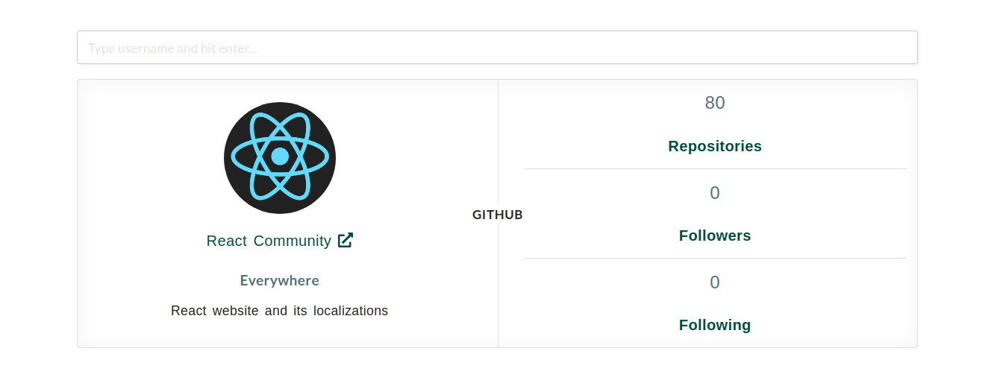
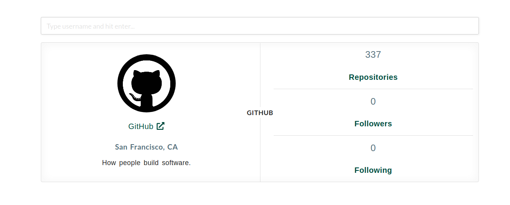
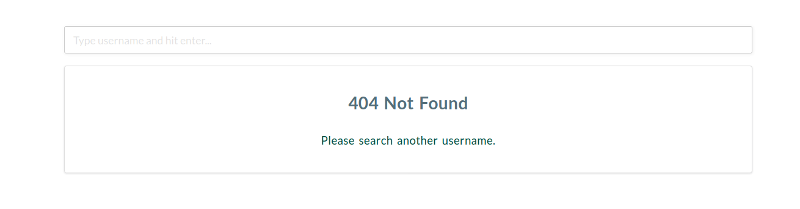
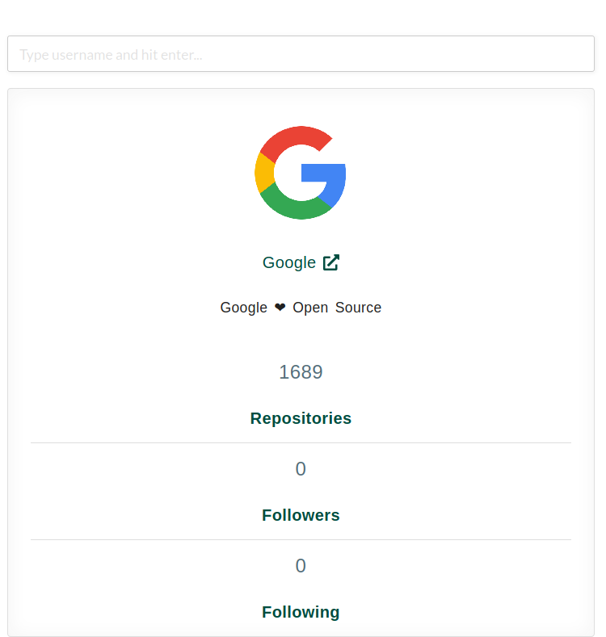

# GitHub Profile Card
GitHub Profile Card Application is developed in [ReactJS](https://reactjs.org/) and [Semantic UI React](https://react.semantic-ui.com/) is used as React UI framework. I have used [Axios](https://www.npmjs.com/package/axios) to make HTTP Request to Github API. In this application we need to enter ```GitHub username``` and we will get github profile of that user. If user does not exist, it will return 404 status code response.

## Demo : [CodeSandBox](https://timnp.csb.app/)

### Demo Image :





### Install Dependencies : 
Clone or download the repo and run command in terminal
``` npm install ```

### Run Application
After installing dependencies run command in terminal
``` npm start ```

## Built With :
- [ReactJS](https://reactjs.org/)
- [Semantic UI React](https://react.semantic-ui.com/)
- [npm axios](https://www.npmjs.com/package/axios)

## Developed By :
* [Shashi Kant Yadav](https://github.com/shashikant712)
